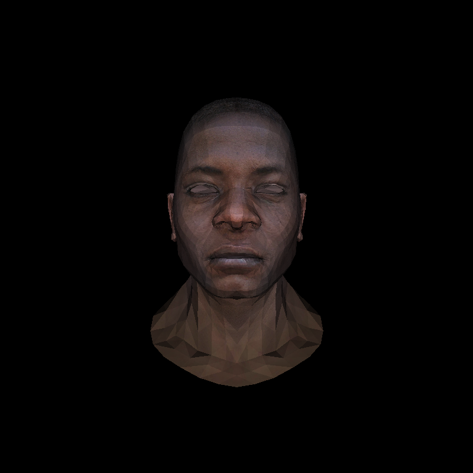
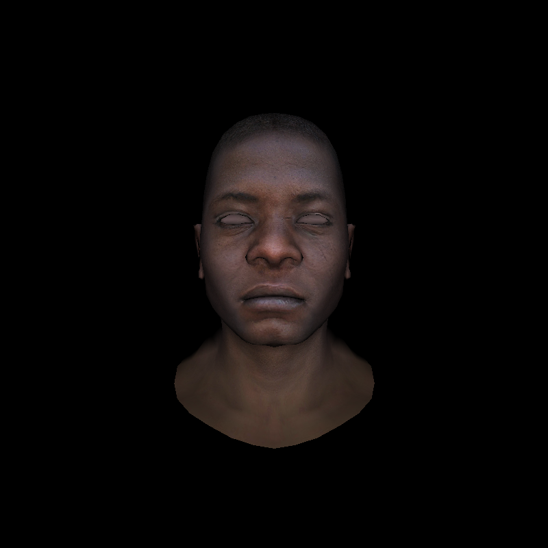

# MyRenderer

一个使用 C++ 实现的 CPU 软件光栅器,用于从底层理解并实践经典光栅化渲染管线.

本项目的学习路线受到 [TinyRenderer](https://github.com/ssloy/tinyrenderer) 启发.
第一次接触 TinyRenderer 时,我能够理解整体渲染流程并实现最终效果,但其中的数学库、模型读取、图像 IO 等部分仍然在很大程度上作为黑盒使用,同时大量渲染逻辑集中在单个函数中.

因此,我重新开始了这个项目,希望不再只关注最终图像,而是逐步实现并理解渲染管线中的各个组成部分,包括:

- 基础线性代数与空间变换
- 图像读写
- 直线与三角形光栅化
- 深度测试
- Model / View / Projection 变换
- 透视除法与 Viewport 变换
- 透视校正插值
- OBJ 模型解析
- UV 纹理映射
- 法线变换与平滑着色

目前项目仍在持续进行中.

---

## Current Result

目前效果展示:
<table>
  <tr>
    <td align="center">
      <br>
      <b>Flat Shading</b>
    </td>
    <td align="center">
      <br>
      <b>Smooth Shading</b>
    </td>
  </tr>
</table>


当前版本已经能够完成:

```text
OBJ Model
    ↓
Model Transform
    ↓
View Transform
    ↓
Projection Transform
    ↓
Perspective Divide
    ↓
Viewport Transform
    ↓
Triangle Rasterization
    ↓
Perspective-Correct Interpolation
    ↓
Z-Buffer
    ↓
UV Sampling + Normal Interpolation
    ↓
Lambert Shading
    ↓
TGA Image
```

当前主程序使用 African Head 模型进行测试,实现了纹理映射以及基于顶点法线插值的平滑 Lambert 着色.
输出结果为app/output/head_uv_normal.tga.
项目使用 CMake 进行构建,需要支持 C++20 的编译器,项目根目录运行:
```
cmake -S . -B build
cmake --build build
```
后运行`./build/main`,渲染结果将输出至`app/output/`.


# Implemented Features
## Math
实现了渲染过程中所需的基础数学工具:
- Vec2 / Vec3 / Vec4
- 向量点积、叉积、模长与归一化
- Mat4
- 矩阵与向量乘法
- 矩阵乘法
- 平移、缩放与旋转矩阵
- Viewport Matrix
- look_at
- Perspective Projection Matrix
- 矩阵转置
- 基于 Gauss-Jordan 消元的矩阵求逆
其中法线变换使用$n' = (A^{-1})^T n$ 处理非均匀缩放等情况下的法线方向变化.


## Rasterization
实现了：
- DDA 直线算法
- Bresenham 直线算法
- 扫描线三角形填充
- 基于重心坐标的三角形光栅化
- 三角形包围盒
- 颜色插值
- 深度插值与 Z-buffer
- UV 插值
- 顶点法线插值
- 透视校正属性插值
透视投影后颜色、UV、法线等表面属性不能直接使用屏幕空间重心坐标进行线性插值,因此通过每个顶点的 $1/w$ 对插值权重进行校正.


## Model Loading
实现了一个简化的OBJ 解析器,目前支持:
- v：顶点位置
- vt：纹理坐标
- vn：顶点法线
- f：三角形面


## Image I/O
实现了基本的 TGA 图像读写,包括:
- 24-bit True Color TGA 输出
- 未压缩 TGA 读取
- RLE True Color TGA 解码
- 像素 get / set
因此当前渲染器能够直接读取 TGA 纹理并输出最终 framebuffer.


## Project Structure
```
Myrenderer/
├── app/
│   ├── main.cpp
│   └── output/
│
├── assets/
│   ├── models/
│   └── textures/
│
├── include/
│   └── myrenderer/
│       ├── geometry.h
│       ├── model.h
│       ├── rasterizer.h
│       └── tgaimage.h
│
├── src/
│   ├── model.cpp
│   ├── rasterizer.cpp
│   └── tgaimage.cpp
│
├── examples/
│   ├── 01_image_io/
│   ├── 02_basic_rasterization/
│   ├── 03_triangle_rasterization/
│   ├── 04_transformations/
│   ├── 05_projection/
│   ├── 06_obj_loading/
│   └── 07_head_rendering/
│
├── docs/
│   └── learning_notes.md
│
└── CMakeLists.txt
```

其中：
- include/myrenderer/:当前 Renderer 对外接口
- src/:当前 Renderer 的实现
- app/:当前完整渲染程序
- assets/:模型和纹理资源
- examples/:开发过程中各阶段的实验代码与渲染结果
- docs/learning_notes.md:实现过程中对数学原理、图形学概念以及代码设计的详细记录

随着项目逐步进行,部分接口和约定发生过变化,早期 example 保留了当时的代码形式,并不保证能够直接使用当前版本的接口重新编译.完整的实现过程与相关推导记录在[`docs/learning_notes.md`](docs/learning_notes.md).


## Roadmap
接下来计划继续完善 Renderer 的结构与渲染管线,项目的目标不是追求成熟图形 API 的功能规模,而是通过自行实现关键模块,建立对经典 Rasterization管线的完整理解.


## Reference

- [ssloy/tinyrenderer](https://github.com/ssloy/tinyrenderer)


